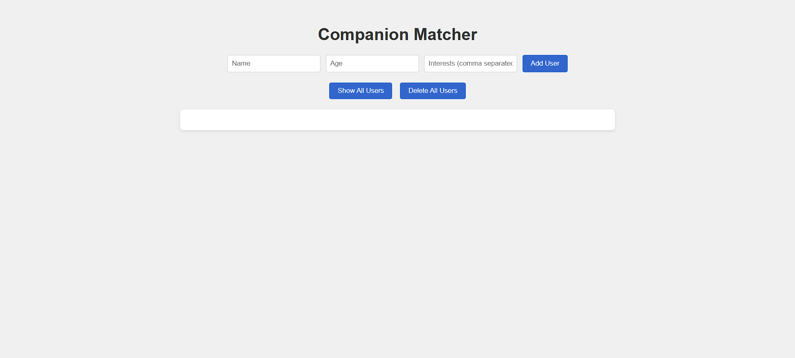
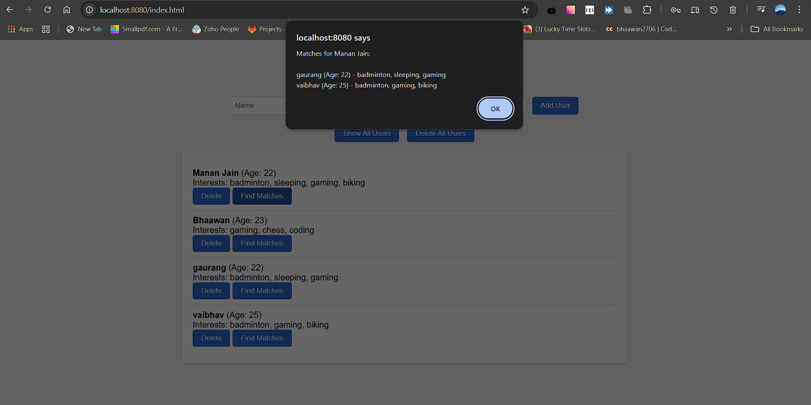
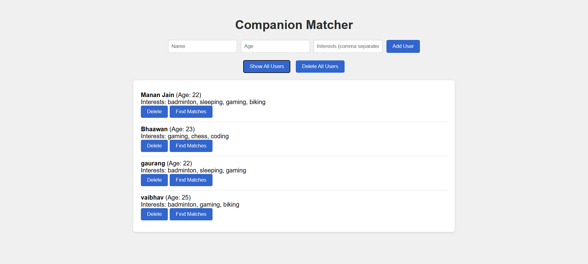

# 🧩 Companion Matcher

A mini-project challenge submission to help users find compatible companions based on shared interests.

---

## 📘 Description of the Idea

The application allows users to register with their name, age, and a list of interests. When a user is registered, the system can identify and display other users who share **two or more common interests**, making them good companions. It also supports listing, deleting, and matching users.

---

## 🛠 Tech Stack Used

- **Frontend:** HTML, CSS, JavaScript
- **Backend:** Java Spring Boot
- **Database:** SQLite using Spring Data JPA
- **Build Tool:** Maven
- **IDE:** IntelliJ IDEA

---

## 🚀 Steps to Run the Application

1. Clone this repository:
   ```bash
   git clone https://github.com/YOUR_USERNAME/companionMatcher.git
   cd companionMatcher
2. Open in IntelliJ or any Java IDE.
3. Ensure you have Java 21 and Maven installed.
4. To run the backend:mvn spring-boot:run
5. Access the frontend by opening: src/main/resources/static/index.html on port 8080
6. The backend runs on: http://localhost:8080

## Notes

1. .db, .db-shm, and .db-wal files are ignored using .gitignore
2. Database auto-creates on app start
3. Data is stored in a local SQLite file (companion.db)
4. Multiple users with same name are allowed but can lead to ambiguity in deletion
5. Use browser dev console or Postman to inspect API requests

## 📸 Screenshots

### 🧾 User Registration Form


### 🧑‍🤝‍🧑 Matched Companions View


### 🧑‍🤝‍🧑 Show all users


